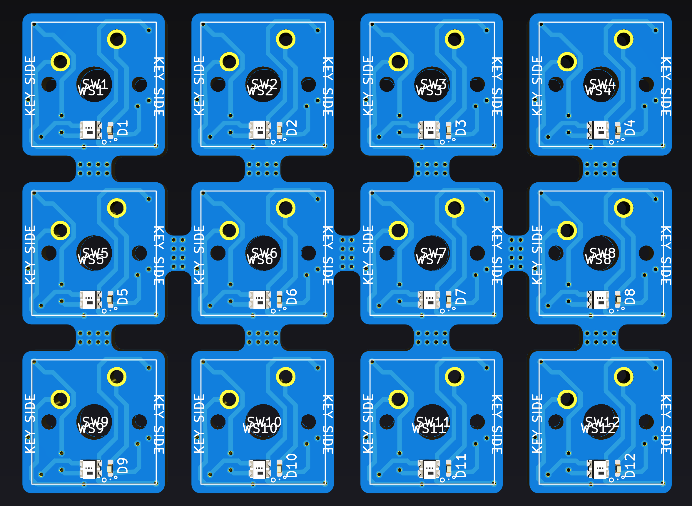
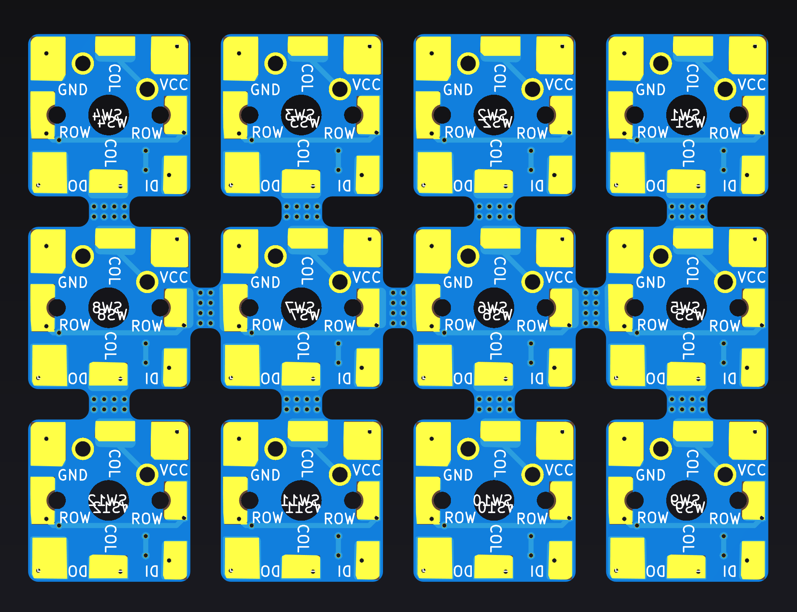

# Wing's MX Switch Board

* WS2812B RGB LED
* Anti-Block/Shadow Diode
* Layout of soldering pads allows for easy COL/ROW/DATA soldering/wiring up.

# CURRENT STATUS

* Pending production parts arriving to be tested
* _Ordered_
* _Designed_

